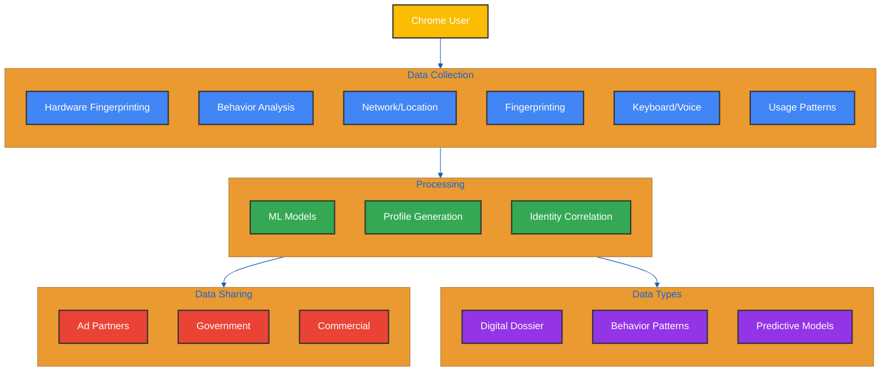

# GoogleGuard - Don't Be Evil

*"Privacy is not an option, and it shouldn't be the price we accept for just getting on the Internet." - Gary Kovacs*

## Table of Contents
1. [Introduction](#introduction)
2. [What this is](#what-this-is)
3. [Chrome Surveillance Architecture](#chrome-surveillance-architecture)
   - [Hardware Data Points And Fingerprinting](#hardware-data-points-and-fingerprinting)
   - [User Behavior Analysis](#user-behavior-analysis)
   - [Network Requests Monitoring](#network-requests-monitoring)
   - [User Engagement Data Modeling and Sharing](#user-engagement-data-modeling-and-sharing)
   - [Complete And In-Depth Details Of Users' Online Life](#complete-and-in-depth-details-of-users-online-life)
4. [How GoogleGuard Overcomes Chrome's Block of Privacy Extensions](#how-googleguard-overcomes-chromes-block-of-privacy-extensions)
   - [Pre DOM Initialization](#pre-dom-initialization)
   - [Navigator API Poisoning](#navigator-api-poisoning)
   - [Canvas Fingerprinting Protection](#canvas-fingerprinting-protection)
   - [Behavioral Data Poisoning](#behavioral-data-poisoning)
   - [Request Sanitization And Header Protection](#request-sanitization-and-header-protection)
   - [The DOM Mutation Observer And Attribute Cleaner](#the-dom-mutation-observer-and-attribute-cleaner)
5. [Installation](#installation)
6. [Configuration](#configuration)
7. [Technical Architecture](#technical-architecture)
8. [Privacy Considerations](#privacy-considerations)
9. [Disclaimer](#disclaimer)
10. [License](#license)

## Introduction
Before you read anything else, the first advice I would give you is, stop using Google Chrome.  Now. Download and use [Ungoogled Chromium](https://ungoogled-software.github.io/ungoogled-chromium-binaries/) or [Brave Browser](https://brave.com/download/). Brave does not implement all the countermeasures used by this extension, however it's still way better than Chrome.  

But if you have to use Chrome, read on and install the extension.

## What this is
This sophisticated Google Chrome extension actively counters Google's abuse of search result pages, and the Orwellian and pervasive tracking and surveillance mechanisms through novel exploitation of the DOM features and use them to clean abusive attributes like ping and mousedown; it also uses fingerprint poisoning and behavioral data injection techniques. In its current form, the extension only addresses Google search result pages or URLs in conjunction with other Google tracking URLs.  I am hoping to expand functionality as time allows.

There are many Chrome extensions attempting to protect users privacy but most of them focus on blocking trackers and not pursuing more advanced ways to block surveillance due to the fact that Google will simply not list them in the extension store. GoogleGuard takes an offensive approach by implementing a combination of advanced countermeasures to block tracking attempts and also actively poisoning tracking data to render it useless for profiling.

## Chrome Surveillance Architecture



### Hardware Data Points And Fingerprinting
When you launch Chrome, even before you start browsing, the surveillance apparatus springs into action. Chrome begins by cataloging your system - not just basic information like operating system and screen resolution, but intricate details about your hardware that create a unique signature. The number of CPU cores, the exact model of your graphics card, the precise amount of RAM, and even the specific drivers installed become part of your profile. This hardware fingerprint is so unique that it can identify your device even if you reinstall Chrome or use incognito mode.

### User Behavior Analysis
But this is just the foundation. As you begin browsing, Chrome's behavioral tracking system activates. Let's say you visit a news website. Chrome isn't just loading the page - it's analyzing how quickly you scroll through headlines, which articles catch your attention (measured by hover time), and even the speed at which you read (tracked through scroll patterns and text selection). It records the slight pauses in your scrolling that indicate interest, the way you move your mouse while reading, and even how long you spend on different parts of the page.

When you type a comment or fill out a form, Chrome's keystroke analysis engine captures your unique typing pattern. It measures not just the words, but the microsecond delays between each key press, how long you hold each key, your common typing errors and correction patterns. This creates what's called a "keystroke dynamics profile" - a fingerprint so unique it can identify you even if you switch devices. If you typically make the same spelling mistake and correct it in a particular way, that pattern becomes part of your profile.

The browser's memory management system, ostensibly for performance optimization, tracks how you use tabs. Do you keep many tabs open? How often do you switch between them? What types of content do you keep open longest? This "tab management fingerprint" adds another layer to your profile. Even the way you arrange your browser windows becomes a datapoint - Chrome tracks window placement, resize patterns, and multi-monitor usage.

### Network Requests Monitoring
As you continue browsing, Chrome's network surveillance system monitors every connection. 

It records not just the websites you visit, but how you found them, how long you stayed, and what you did there. The browser analyzes your DNS lookups, monitoring how you navigate the web. Are you using a VPN? Chrome can often detect this through subtle timing patterns in your network requests. Even if you're browsing through Tor, Chrome's behavioral tracking can potentially identify you based on your usage patterns.

The real power of Chrome's surveillance becomes apparent in its data correlation engine. Every piece of data is timestamped and cross-referenced. That morning news article you read? Chrome correlates it with your location data, the weather at your location, the device you were using, and even your scroll speed (are you reading faster in the morning?). It notices that you read slower when articles mention certain topics, scroll faster past certain types of content, and have specific reaction patterns to different types of media.

### User Engagement Data Modeling and Sharing
Google's machine learning algorithms process this data to create what they call a "Google user engagement model." This model is so detailed it can predict your interests before you even know them. If you've started reading more articles about a particular topic, slowing down on certain types of content, or showing subtle changes in your browsing patterns, Chrome's algorithms detect these shifts and update your profile accordingly.

This profile isn't just used for advertising. Through various data-sharing agreements and legal frameworks, this information can be accessed by government agencies, law enforcement, and commercial partners. 

### Complete And In-Depth Details Of Users' Online Life
Your Chrome profile becomes part of what's known as your "Google digital dossier" - a comprehensive record of your online life that can be used to predict your behavior, manipulate your choices, and monitor your activities.

The most concerning aspect is Chrome's ability to correlate identities across sessions and devices. Even if you use different computers, Chrome can often link your sessions together through behavioral patterns. 

The way you use keyboard shortcuts, your reading speed, your common typing errors - these patterns are as unique as a fingerprint. Combined with Chrome's hardware fingerprinting and network analysis, this creates a tracking system that's nearly impossible to evade through conventional means.

# How GoogleGuard Overcomes Chrome's Block of Privacy Extensions
The extension achieves ping blocking through a sophisticated multi-layered approach that outmaneuvers Chrome's restrictions on privacy extensions. The key innovation lies in a multi layer approach implementing novel techniques and attack vectors against established Chrome compponents like the DOM (exploiting the DOM to monitor for mutated attributes and clean them) and API, using legitimate pathways to subvert Chrome's built-in surveillance.

## Pre DOM Initialization 
At the core of this approach is an aggressive early initialization strategy. The extension's content script is configured to inject at "document_start" in the manifest, ensuring it runs before the document begins parsing and before any DOM elements exist. This timing is crucial - it allows the extension to establish its protective measures before Google's tracking scripts can initialize or attach any listeners. The extension immediately begins overriding and poisoning key browser APIs that Google's tracking systems depend on, effectively corrupting the tracking environment before it can establish itself.

## Navigator API Poisoning
Chrome uses the Navigator API to collect detailed system information for fingerprinting. GoogleGuard employs a novel approach of dynamic property poisoning through JavaScript Proxy objects and getter function manipulation. Rather than simply blocking navigator.sendBeacon or access to these properties (which itself can create a unique fingerprint) - and would be detected and prevented by Chrome , GoogleGuard returns randomized but plausible values that change periodically, a sophisticated fake implementation. This replacement appears to function normally but always returns false, signaling to Google's code that the ping attempt failed. This is particularly clever because it works within Chrome's rules while completely undermining the tracking functionality. The false return value typically causes Google's code to abandon retry attempts, believing there's a legitimate network or configuration issue.

```javascript
%%{init: {
  'theme': 'base',
  'themeVariables': {
    'primaryColor': '#6495ED',
    'primaryTextColor': '#fff',
    'primaryBorderColor': '#5278c8',
    'lineColor': '#5278c8',
    'secondaryColor': '#73c6b6',
    'tertiaryColor': '#f1948a',
    'backgroundColor': '#000000'
  }
}}%%
const navigatorProps = {
    hardwareConcurrency: { get: () => getRandomInt(1, 32) },
    deviceMemory: { get: () => getRandomFromArray([0.5, 1, 2, 4, 8, 16, 32]) },
    platform: { get: () => getRandomFromArray(platforms) },
    languages: { get: () => [getRandomFromArray(languages), getRandomFromArray(languages)] },
    userAgent: { get: () => getRandomFromArray(userAgents) }
};
```

This dynamic poisoning makes it difficult for tracking scripts to establish a consistent device fingerprint, although some of the poisoning code could be further improved. The values change every few seconds and are coordinated across all API endpoints to maintain internal consistency and avoid detection.

## Canvas Fingerprinting Protection 
Canvas fingerprinting is one of Chrome's most powerful tracking mechanisms. It works by using the Canvas API to render text/graphics and generating a hash of the pixel data, which varies subtly between devices due to hardware/driver differences. In this extension, I implemented a novel defense that adds controlled randomization to the rendering process:

```javascript
context.getImageData = function() {
    const imageData = originalGetImageData.apply(this, arguments);
    const pixels = imageData.data;
    for (let i = 0; i < pixels.length; i += 4) {
        // Add subtle noise to RGB channels while preserving image appearance
        pixels[i] += getRandomInt(-1, 1);     // Red
        pixels[i + 1] += getRandomInt(-1, 1); // Green
        pixels[i + 2] += getRandomInt(-1, 1); // Blue
        // Alpha channel (pixels[i + 3]) is left unchanged
    }
    return imageData;
};
```

This technique modifies individual pixel values by ±1, which is imperceptible to users but leading to changes in the fingerprint hash. The noise is deterministic within a session but varies between sessions, preventing cross-session tracking while maintaining normal website functionality.

## Behavioral Data Poisoning
The behavioral deception layer adds another sophisticated dimension to the protection. The extension doesn't just block tracking attempts - it actively poisons them with carefully crafted fake data. This includes manipulated timing information, synthetic behavioral data, and falsified interaction patterns. This approach ensures that even if some tracking data somehow makes it through the other protective layers, it's mixed with so much synthetic noise that it becomes unreliable for tracking purposes.

What makes this extension particularly effective is its multi-layered redundancy. Each layer operates independently but complementarily, creating a robust defense that's resistant to failure. If Chrome updates prevent one protection method from working, the others continue to function. The system doesn't rely on any single approach to achieve its privacy goals, making it remarkably resilient to future browser changes or attempts to circumvent its protection.

The real innovation here lies in how the extension works within Chrome's rules while completely subverting their intended limitations on privacy extensions. Rather than fighting Chrome's restrictions head-on, it uses Chrome's own APIs and permitted functionality to create a hostile environment for tracking systems. This approach not only achieves its privacy goals but does so in a way that's much harder for Google to prevent without breaking legitimate webpage functionality.

The code injects false behavioral data to contaminate Chrome's behavioral profiling system. This isn't simple random noise - the extension generates statistically plausible user behavior patterns:

```javascript
window.__userBehavior = {
    clicks: Array.from({length: Math.floor(Math.random() * 8) + 3}, () => ({
        x: Math.floor(Math.random() * 1000),
        y: Math.floor(Math.random() * 800),
        timestamp: Date.now() - Math.floor(Math.random() * 30000),
        type: ['left', 'left', 'left', 'right'][Math.floor(Math.random() * 4)]
    })),
    scrolls: Array.from({length: Math.floor(Math.random() * 15) + 5}, () => ({
        position: Math.floor(Math.random() * 3000),
        timestamp: Date.now() - Math.floor(Math.random() * 60000),
        speed: Math.floor(Math.random() * 100) + 20
    })),
    timing: {
        pageLoadTime: Math.floor(Math.random() * 1000) + 500,
        domContentLoaded: Math.floor(Math.random() * 300) + 200,
        firstPaint: Math.floor(Math.random() * 200) + 100
    }
};
```

The injected data mimics natural user behavior patterns while introducing enough variance to disrupt behavioral fingerprinting. The poisoned timestamps generated by the extension are properly sequenced, and synthetic mouse movements generated by the extension follow natural curves with scroll patterns matching human reading behavior.

## Request Sanitization And Header Protection

Chrome includes tracking parameters in various network requests. This extension implements both declarative and dynamic request modification rules:

```javascript
// Declarative rules (rules.json)
{
    "id": 1,
    "priority": 1,
    "action": { "type": "block" },
    "condition": {
        "urlFilter": "*/gen_204",
        "domains": ["google.com"]
    }
}

// Dynamic header sanitization
function sanitizeHeaders(headers) {
    const clean = new Headers(headers);
    ['set-cookie', 'etag', 'last-modified', 'x-client-data'].forEach(header => {
        clean.delete(header);
    });
    clean.set('DNT', '1');
    clean.set('Sec-GPC', '1');
    return clean;
}
```

The extension combines declarative rules for known tracking endpoints with dynamic request modification for header sanitization. This dual approach ensures both efficient blocking of known trackers and adaptive protection against new tracking mechanisms.

## The DOM Mutation Observer And Attribute Cleaner
The DOM protection layer represents another crucial innovation. Instead of attempting to block html pings using anchor tags using the network layer - which Chrome now prevents extensions from doing - the extension implements an aggressive DOM sanitization system. A sophisticated MutationObserver is established that watches for any changes to the document. The moment any new element is added to the DOM, or any existing element is modified, the observer immediately inspects and sanitizes it, removing ping attributes and other tracking mechanisms before they can be activated. This approach is particularly effective because it prevents the ping mechanism from ever being properly established, rather than trying to block it after the fact.
Google embeds tracking attributes throughout the DOM to monitor user interactions. GoogleGuard actively cleanses these attributes while preserving page functionality:

```javascript
function cleanNode(node) {
    if (!node || !node.removeAttribute) return;
    
    const trackingAttrs = [
        'ping', 
        'onclick', 
        'onmousedown', 
        'data-ved', 
        'data-ei', 
        'data-s', 
        'data-cid'
    ];
    
    trackingAttrs.forEach(attr => {
        if (node.hasAttribute(attr)) {
            node.removeAttribute(attr);
        }
    });
}
```

A mutation observer continuously monitors for new elements and dynamically removes tracking attributes, ensuring protection even against dynamically injected tracking code.

## Installation
Google does not allow this extension to be listed in the Google Chrome Webstore so you have to install it manually as an "unpacked extension.  Please follow the steps below:

1. Clone the repository or download the googleguard.zip file
2. Unzip the file into a "googleguard" directory
3. Open Chrome's extension page (chrome://extensions/)
4. Enable Developer Mode (top right toggle)
5. Click "Load unpacked" and select the extension directory unzipped from googleguard.zip or the cloned repo
6. Enjoy protection from Google's surveillance

## Configuration

GoogleGuard provides granular control over its protection mechanisms through the popup interface. Each feature can be individually toggled:

- **Tracking Data Poisoning**: Controls the injection of false behavioral data
- **Behavioral Noise**: Manages the addition of random interaction data
- **Header Sanitization**: Toggles request header cleaning
- **Identifier Randomization**: Controls browser fingerprint randomization

The extension's popup interface also provides real-time statistics showing:
- Number of tracking requests blocked
- Amount of data poisoned
- Tracking parameters removed
- Protection status

## Technical Architecture

```
├── manifest.json                  # Extension configuration and permissions
├── background/
│   ├── proxy_worker.js            # The main worker serving as a proxy
├── content/
│   ├── content.js                 # DOM manipulation and real-time cleaning
│   ├── interceptNavigatorAPIs.js  # Browser API poisoning
│   ├── interceptStorageAPIs.js    # Storage access protection
│   ├── injectProtectionScript.js  # Behavioral data injection
├── popup/                         # User interface components
│   ├── popup.html                 # Popup layout
│   ├── popup.css                  # Interface styling
│   └── popup.js                   # UI logic and stats
├── rules/
│   ├── rules.json                 # Declarative network rules
├── icons/                         # Icons
│   ├── icon16.png
│   ├── icon48.png
│   ├── icon128.png
```

## Privacy Considerations

GoogleGuard employs a "defense in depth" strategy that goes beyond simple blocking:

1. **Active Prevention**: Blocks known tracking mechanisms through declarative rules
2. **Data Poisoning**: Contaminates tracking data with plausible false information
3. **Fingerprint Randomization**: Prevents stable device identification
4. **Request Sanitization**: Removes identifying information from network requests
5. **Continuous Monitoring**: Tracks and displays protection metrics

## Disclaimer

This extension is provided for educational and privacy protection purposes. Users are responsible for compliance with applicable terms of service and laws in their jurisdiction.

## License

This project is licensed under GNU General Public License v3.0 - see the LICENSE file for details.
